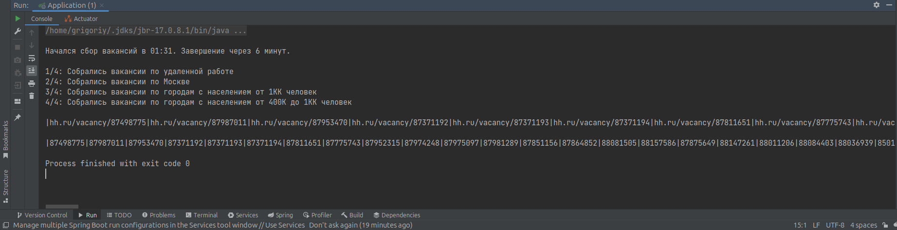

# Парсер вакансий с сайта hh.ru

Последний раз программа запускалась 8 ноября 2023, и она работала.

Настройки сделаны для сбора вакансий под себя.

Если вы ищете работу по Java на позицию до Middle+, и у вас опыта до 3-х лет, то менять ничего не нужно. Просто запустите программу, и она соберет вакансии.

Если опыта больше 3-х лет, или ищите вакансии на позицию Middle+ или выше, то нужно удалить с файла "BlackList.txt" важные для вас ключевые слова. Например, Middle+, Senior, Senior+, Architect и другие. Также в классе VacancyService нужно убрать условия по опыту работы: от 3 до 6 лет, более 6 лет и прописать условие, что не подходят вакансии от 1 до 3 лет.

## Как настроен сейчас парсер
1. Ищется ключевое слово "Java" в названии вакансии, в названии компании, в описании вакансии.
2. Вакансии сортируются по дате публикации и дате обновления. Вначале списка новые вакансии.
3. Вакансии ищутся с опытом от 1 года до 3 лет и те, где опыт не указан.
4. Вакансии ищутся по 4 локациям (они будут написаны ниже).
5. В результирующий список не добавляются вакансии, если id вакансии есть в файле ViewedVacanciesIds.txt и если в названии вакансии (в должности) есть какое-то слово или фраза из файла BlackList.txt.

## Вакансии собираются по 4-м локациям
- по удаленной работе (весь сайт hh)
- по Москве (офисный формат работы)
- по городам с населением от 1 млн человек, кроме Москвы (офисный формат работы)
- по городам с населением от 400,000 до 1 млн человек (офисный формат работы)

## Почему выставлены эти 4 локации, когда я ищу удаленную работу?
Так было сделано, потому что даже там, где указан офисный формат работы могут предложить удаленно работать. Также на сайте hh можно получить максиму 2,000 вакансий в выдаче, а так как тут указано 4 разных локации, то максимум можно получить 8,000 вакансий, что увеличит вероятность на более быстрое нахождение работы. Но... Важно понимать, что фактическое количество вакансий по ключевому слово Java на сайте hh на октябрь 2023 около 6,000 штук. В этих 6,000 вакансий встречаются вакансии, не связанные с Java. Я уже собрал основные слова и фразы в файл "BlackList.txt", чтобы ненужные вакансии не появились в итоговой выборке. За первый раз соберется около 500 полезных вакансий. После просмотра этих вакансий нужно id просмотренных вакансий добавить в файл "ViewedVacanciesIds.txt". При повторном сборе вакансий за каждые следующие 10 дней будет новых вакансий около 40. За полный месяц около 120 новых вакансий (без дублей). Это статистика за сентябрь-октябрь 2023.

## Сколько времени будут собираться вакансии по 4-м локациям выше?
Примерно 6 минут.

## Где увидеть результат по собранным вакансиям
Вакансии появятся в output'е. Для их вывода используется System.out.println().

## Пример как будет выглядеть список вакансий
|hh.ru/vacancy/8514629432|hh.ru/vacancy/8514623833|hh.ru/vacancy/8514634471

Такой формат подходит, чтобы вставить в Firefox и там массово открыть вкладки с новыми вакансиями (от 40 до 500 штук).

## Как в пару кликов в браузере открыть от 40 до 500 вкладок с вакансиями?

Шаг 1: В Firefox 118.0.1 открыть настройки, там будет вкладка "Начало", там найти "Домашняя страница и новые окна", выбрать "Мой сетевой адрес". Вставить строку со списком вакансий.

Шаг 2: Закрыть браузер.

Шаг 3: Выключить интернет (LAN, Wi-Fi) - так нужно сделать, чтобы hh не заблокировал за многочисленные запросы открытия вакансий. Если забыть это сделать, и сразу включить браузер, то начнутся загружаться вакансии (от 40 до 500) и hh может временно заблокировать за многочисленные запросы.

Шаг 4: Когда выключили интернет, включаем браузер. Он создаст вкладки с вакансиями, но все они выдадут ошибку, что не удалось ничего загрузить, так как интернет не работает.

Шаг 5: Например, было вставлено 500 ссылок на вакансии. Чтобы начать их просматривать, нужно открывать по 20 вакансий за 1 раз. Их подгрузить, посмотреть, откликнуться, и далее переходить к следующим 20.

Шаг 6: После просмотра вакансий нужно их id добавить в файл "ViewedVacanciesIds.txt", чтобы при повторном сборе вакансий просмотренные старые вакансии не появились, а был список из новых вакансий.

## Еще про ограничения от hh
Чтобы вакансии без проблем собрались за 6 минут в коде есть в двух местах Thread.sleep() с выставленными значениями.

## Про файлы BlackList.txt и ViewedVacanciesIds.txt

В файл "BlackList.txt" сохраняются списки слов и фраз, которые ищутся в названии вакансии (в должности). Если там найдется что-то из этого файла, то вакансия не добавится. Обязательно добавлять новые варианты в этот файл с маленьких букв. Вначале и в конце не должно быть символа |
```
Формат заполнения:
bitrix|битрикс|php|пхп
```

В файл "ViewedVacanciesIds.txt" сохраняются id вакансий, которые уже были просмотрены. Этот список нужен, чтобы при повторном сборе вакансий в новый список вакансий не попали старые вакансии, которые ранее уже были просмотрены. Вначале и в конце не должно быть символа |
```
Формат заполнения:
86522322|86882799|87344682|86922603
```

## Что важно сделать до первого запуска парсера
Есть файл "ConstantsUtils.java". В нем две переменные: PATH_TO_BLACK_LIST и PATH_TO_VIEWED_VACANCIES_IDS. Нужно указать ваши пути к файлам.

## Скриншот


## Идеи для доработки
1. Все идеи ниже лучше сделать со Scanner.
2. Сейчас жестко привязан поиск вакансий по-ключевому слово "Java". Вынести ключевое слово в параметры метода, чтобы можно был там указать Java или другой язык. Сделать перечисление и указать там Java и другие популярные языки.
3. В ссылке для парсинга есть кусок "search_field=company_name&search_field=description&search_field=name". Нужно сделать разные опции. В зависимости от того, что будет выбрано, там и искать ключевое слово.  Сделать перечисление и указать там эти три варианта + общий.
4. Сделать перечисление и туда написать варианты: TRAINEE, JUNIOR, MIDDLE, SENIOR, TEAM_LEAD, ARCHITECT. Далее под это перечисление переделать код. В зависимости от того, что будет выбрано нужно искать такие вакансии. Для этого учитывать условие по опыту, по зарплате, по названию должности (придется под каждую должность свои слова в BlackList.txt добавлять или очищать). Например, если ищет SENIOR, то нужно добавить в черный список все должности от TRAINEE до MIDDLE. Если ищет JUNIOR, то убрать SENIOR и выше, а может и MIDDLE.
5. Сделать фильтрацию вакансий по доходу. Например, если кто-то ищет работу на позицию Junior, то не собирать вакансии с доходом от 140К. Сделать условие от ..., от и до, до.

## Мои контакты
| Имя      | Номер + WhatsApp | Telegram           | Почта                 |
|----------|------------------|--------------------|-----------------------|
| Григорий | 8-924-116-18-34  | posmitniy_grigoriy | pga.profile@gmail.com |